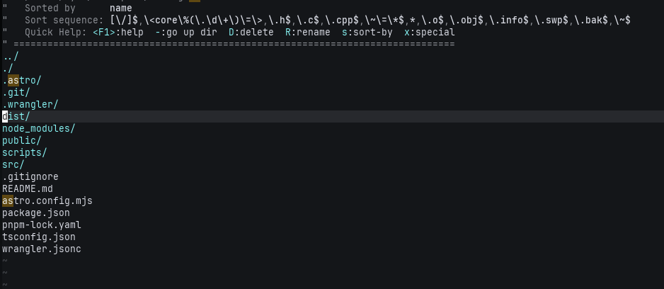

Neovimに何度も挑み敗北している僕が、また懲りずにNeovimに入門しようとしているだけの話です。

暖かく見守ってもらえますと嬉しいです。

## モチベーション

最近Astroを使って個人ブログをはじめました。
チュートリアルからそれほどいじってはいなく、機能の追加はCloudflare Workersに載せ替えたこと と マークダウンの雛形をコマンドで作るようにしました。

さて、記事を書こうかとVSCodeを立ち上げようとしたときのこと、今までOpencodeをターミナル上で使用していたのにわざわざエディタを立ち上げることを面倒だと感じました。

最近TwitterでTmuxやAerospaceなどのツールを知って、自身のPCにセットアップすると格段にキーボードでできて直感的な操作が板についてきたのもあり、マウスに手を伸ばすのか？と思えるようになってきました。

これまでにないVimへの移行の動機なんじゃないでしょうか？（個人的にですが、Vimmerはよくマウス使うなんて、、、って口にしているイメージがある）

じゃあ今ならNeovim使えるようになれるかも、と思い再挑戦を決めました。

## 今回の挑戦

幾度とNeovimを使いたい（かっこいいから）と思い、挑戦してきました。
ある時はYoutuberの.configを真似たり、lazyvimをそのまま使ってみたりチャレンジしてきました。

その度に、コマンドがわからず脱落、コマンドを覚えてもすぐ使わなくなり忘れる


### 基本設定

最初にどうしても行番号を表示させたくて、どんなライブラリを使うんだ、、、と一生懸命調べていました。
このチュートリアルの記事を見つけて、Vimの基本的な設定のみであることを知りました。
最初はこれだけ設定しました。

```lua
vim.opt.number = true         -- 行番号を表示 (nu)
vim.opt.relativenumber = true  -- 相対行番号を表示 (rnu)
vim.opt.cursorline = true -- cursor行をハイライト
```

これを`~/.config/nvim/init.lua`に書いて再起動すると、行番号とカーソルのある行がハイライトされました！


### lazy.nvimを入れる

私は[LazyVim](https://www.lazyvim.org/) を入れていたときがあったので、LazyVimと[lazy.nvim](https://lazy.folke.io/) があるのは認知していました。
lazy.nvimとはLazyVimで使われているNeovim用のパッケージマネージャーだそうです。
何者なのかは詳しくはわかっていませんが、便利だそうなので今回使ってみます。

公式のInstallation、そのまま設定します。
最初は`~/config/nvim/lua/plugins/`配下をからにして起動したために以下のエラーが出ました。

```sh
Error detected while processing /Users/kyou/.config/nvim/init.lua:
No specs found for module "plugins"
```
適当にinit.luaを作成して起動し直すと、無事設定できていました。
デフォルトでファイル検索が開くようになっていまして、最初から何かインストールされた？ものか
（おそらくは過去自分が入れたものが残っている？）、
ファイルツリーを移動できる画面が起動時に動くようになっていました。



これでファイルの移動だったりとかが、便利にできるようになりました。

## ちょっとNvimが使えるように？

後はとりあえずVimになれるため、この記事も早速設定したNvimで書いてみました。
少しコマンドは知っていたのですが、今回触ったことで以下のコマンドも追加で覚えました。
```
:e {ファイル名} -- 指定したファイルの編集
:cd {移動先のディレクトリの相対パス} -- 相対パスで指定した先にファイルを移動

```

まだまだ欲しい機能はたくさんありますが、一旦は慣れるためにもいっぱい記事書いていきます！


