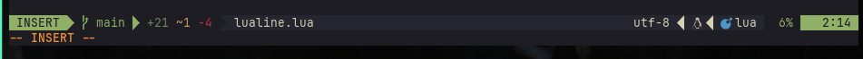
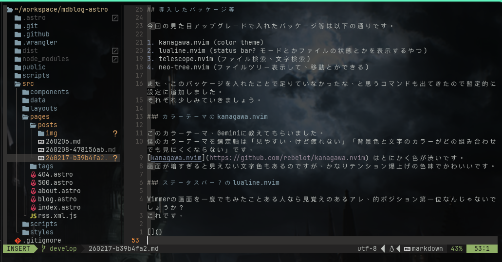

Neovimを一からプラグインを入れて自分好みにカスタマイズすることで、自然と愛着を持って使うようになる作戦でNeovim入門をチャレンジ中です。
今回は、プラグインをかなり満足するぐらい入れたので（といっても機能的にはメモ帳と変わりませんが）、一旦書き残そうと思います。

## 今回の目標

とりあえず味気のないエディタの画面は面白くないので、見た目を超かっこよくします！
それだけです。
かっこよくファイル移動もできるようにしました。

見た目大事です。
モチベーションを爆上げしてくれるし、人にも自慢したくなります。

そんなわけで自分のNvimの見た目をよくしていきますが、参考はLazyVimです。とりあえず。
なんのパッケージを入れればいいかわからないので、「このパッケージはこの役割なんだな」を知ることを目的とします。

## 導入したパッケージ等

今回の見た目アップグレードで入れたパッケージ等は以下の通りです。

1. kanagawa.nvim (color theme)
2. lualine.nvim (status bar? モードとかファイルの状態とかを表示するやつ)
3. telescope.nvim (ファイル検索、文字検索)
4. neo-tree.nvim (ファイルツリー表示して、移動とかできる)

また、このパッケージを入れたことで足りていなかったな、と思うコマンドも出てきたので暫定的に設定に追加しました。
それぞれ少しみていきましょう。

### カラーテーマのkanagawa.nvim

このカラーテーマ、Geminiに教えてもらいました。
僕のカラーテーマを選定軸は「見やすい、けど疲れない」「背景色と文字のカラーがどの組み合わせでも見にくくならない」です。
[kanagawa.nvim](https://github.com/rebelot/kanagawa.nvim) はとにかく色が渋いです。
画面が暗すぎると見えない文字色もあるのですが、かなりテンション爆上げの色味でかわいいです。

### ステータスバー？のlualine.nvim

Vimmerの画面を一度でもみたことある人なら見覚えのあるアレ、的ポジション第一位なんじゃないでしょうか？
これです。



これを設定するとデフォルト設定のモード表示がいらなくなるので、init.luaに以下を追加して隠しておきましょう

```lua
vim.opt.showmode = false -- lualineと重複のため削除
```

### 楽々検索のtelescope.nvim

言わずと知れたtelescopeです。
私もなぜか知っています。
普段ターミナルはzoxideとfzfでファイルの曖昧検索をしているので、イメージそのまま使えています。
（Intellij IDEAだとshift*2すると出てくる検索ウィンドウがイメージそのままでした）

ファイル検索もできますが、バイナリの検索もできるのでファイルの中の文字列も検索対象にできます。
ファイル跨いで変数名を変更した時とか、便利です。

### ファイルツリーが見れるneo-tree.nvim

ファイルツリー見れるだけじゃないです。
一通りディレクトリ操作ができます。
ファイルコピーしたり、作成・削除、もちろん指定ファイルを開くこともできます。
ほぼIDEに必ずついているファイルツリーの機能が備わっているので、このパッケージも特にギャップなく便利に使用できています。

### Nvim内でファイルを開くと、タブが気になる

ファイルをどんどん開くようになると、使っていくうちに要望が出てきました。

- 新しいタブで開きたい
- 見比べるために、横に並べて表示したい
- タブを開きすぎたので、閉じたい
- タブ間を簡単に行き来したい

上2つはパッケージにすでにコマンドが割り当ててあったりして、特に困ることがありませんでした。
しかし、タブを閉じる・タブ間の移動は定義されていませんでした。

ここでタブを自由に操るために、`nvim/lua/keymap.lua`にコマンドを追加しました。

```lua
-- タブ操作
keymap.set('n', '<Tab>', ':tabnext<CR>', { noremap = true, silent = true, desc = '次のタブへ移動' })
keymap.set('n', '<S-Tab>', ':tabprevious<CR>', { noremap = true, silent = true, desc = '前のタブへ移動' })
keymap.set('n', '<leader>w', ':tabclose<CR>', { noremap = true, silent = true, desc = 'タブを閉じる' })
keymap.set('n', '<leader>t', ':tabnew<CR>', { noremap = true, silent = true, desc = '新しいタブを開く' })

-- 代替キーマップ（数字でタブ移動）
keymap.set('n', '<leader>1', '1gt', { noremap = true, silent = true, desc = 'タブ1へ移動' })
keymap.set('n', '<leader>2', '2gt', { noremap = true, silent = true, desc = 'タブ2へ移動' })
keymap.set('n', '<leader>3', '3gt', { noremap = true, silent = true, desc = 'タブ3へ移動' })
keymap.set('n', '<leader>4', '4gt', { noremap = true, silent = true, desc = 'タブ4へ移動' })
keymap.set('n', '<leader>5', '5gt', { noremap = true, silent = true, desc = 'タブ5へ移動' })
```

一旦、このようにしました。
leader + t, leader + wは完全にChromeのイメージそのままで設定しました。
これである程度タブを快適に操作できるようになりました！

## 今回の成果

今回の完成系はこちら



これだけで、玄人感が出てきたのではないでしょうか、、（？）
コードの書き心地は、以前としてメモ帳と対して変わりませんが、すごくおしゃれになりましたね。
テンション爆上げです！

これからもNvimを育てていきます。
最終ゴールはJava,Springが快適にかける環境を、追い求めます。が難しそう、、、
前段階としてTypeScript, JavaScriptの環境からセットアップしようと思ってます！
