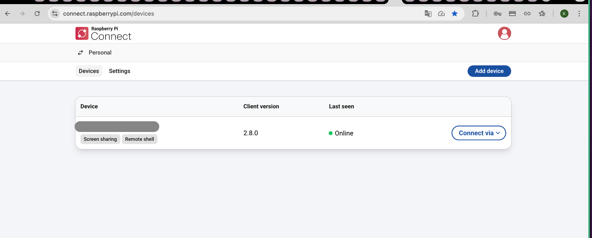
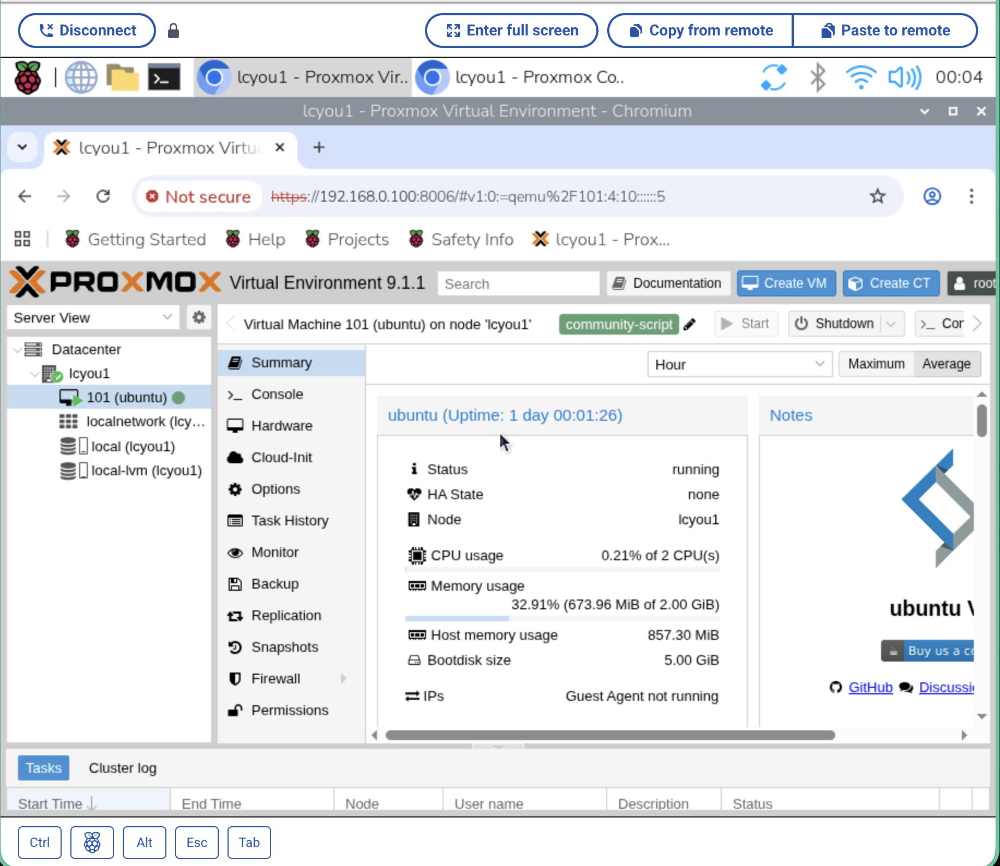

手元のRaspberry Pi 4BにOSを焼き直して、外出先からでもProxmoxのダッシュボードをいじいじできる環境を作りました。

## モチベーション

自宅にProxmoxを動かしているサーバーがあって、LANの中からはダッシュボードにアクセスできます。
ただ外出先からさわりたいとなると、TailScaleというOSSのVPNを使ってローカル環境に繋いでダッシュボードにアクセスしていました。
設定もほぼゼロでVPNが張れるのでかなり重宝していました。
Raspberry Pi Connectの存在を知り「これで同じことできるんじゃ？、なんなら自宅の環境にリモートアクセスできてGUIがある、、、いろいろできそうでは？」と試してみることにしました。

## Raspberry Pi Connectとは

Raspberry Pi財団が公式に提供しているリモートアクセスサービスです。
Raspberry PiにConnectをインストールするだけで、ブラウザ経由でリモートデスクトップ（？）ができるようになります。
TailScaleと違うのは、Raspberry Piがあれば特に考えることがないということと、ルーター設定なしでNAT越えができる点です。

## やったこと

### Raspberry Pi OSを焼き直す

手元のRaspberry Pi 4BのSDカードにUbuntu を入れていたが引っ越し後あまり用途がなく、この機会にOSごと焼き直しました。
Raspberry Pi ImagerでOSを選んで焼くだけなので、ここは特にハマるポイントはありません。

```
使用OS: Raspberry Pi OS (64-bit) Bookworm
```

焼くときにImagerの設定画面でSSHの有効化とWi-Fiの設定を済ませておくと、初回起動からヘッドレスで操作できて楽です。
そして、同じタイミングでRaspberry Pi Connectの設定をするかも聞かれます。
必要なのはRaspberry Pi Accountのみ。複数アカウントの管理を考えなければすごく使い勝手もいいと思います。

アカウントに追加が完了すると、raspberry pi connectに機器が登録されています。


### ProxmoxのダッシュボードにLAN越しにアクセスする

Raspberry PiはProxmoxと同じLANにいるので、Raspberry Pi経由でProxmoxのダッシュボードにアクセスする流れです。

```
[外出先のPC]
  → Raspberry Pi Connect (インターネット越し)
    → Raspberry Pi上のブラウザ
      → Proxmoxダッシュボード (LAN内 192.168.x.x:8006)
```

Raspberry Pi ConnectでリモートデスクトップしてChromiumを開き、ProxmoxのIPとポート（`:8006`）にアクセスするだけです。
全然詰まることなく、リモートから自宅のラズパイにアクセスすることができました。



## TailScaleと比べてどう？

| | Raspberry Pi Connect | TailScale |
|---|---|---|
| 対応デバイス | Raspberry Pi専用() | なんでも |
| セットアップ | Raspberry Pi Accountに登録する必要あり | 各端末をVPNに参加させる必要あり |
| NAT越え | 自動 | 自動？ |
| SSH | ○ | ○ |
| リモートデスクトップ | ○（ブラウザから） | x |


Raspberry Pi専用とはいえ、今回の用途（Raspberry Pi経由でLAN内のサービスにアクセス）にはRaspberry Pi Connectで十分でした。
むしろリモートデスクトップがブラウザからサクッと使えるのは体験がよかったです。

## まとめ

- Raspberry Pi ConnectはRaspberry Pi公式のリモートアクセスサービスで、設定がとにかく簡単
- LANの中にいるProxmoxのダッシュボードにも、Raspberry Pi経由でどこからでもアクセスできるようになった

ホームラボを外から触りたい人はぜひ試してみてください！
