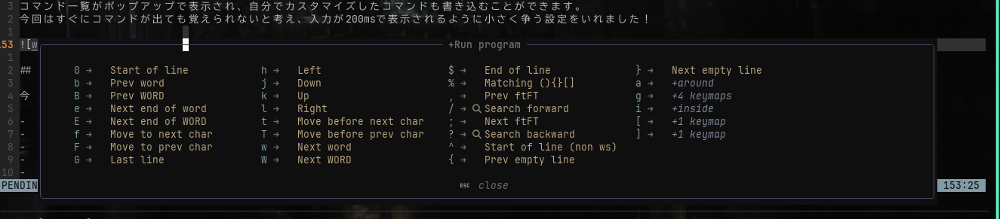

前回は見た目をかっこよくしてモチベーションを爆上げしたので、今回はいよいよ実用的な機能を追加していきます。
Neovimを本格的なコードエディタとして使うために、LSPや補完機能を導入しました。

が、ここで設定の複雑さに直面し、「あれ、これ思ったより大変かも、、、」となりつつあります。

## 今回の目標

前回はあくまで見た目重視で、機能的にはメモ帳とほぼ変わりませんでした。
今回は、以下の機能を追加して、ちゃんとしたコードエディタにしていきます。

- コードの構文チェックやエラー検出（LSP）
- 変数名や関数名の自動補完
- コードの自動整形

最終的にはTypeScriptやRustを快適に書ける環境を目指しています！

## 導入したプラグイン

今回導入したプラグインは以下の3つです。

1. nvim-lspconfig (LSP設定)
2. nvim-cmp (補完エンジン)
3. conform.nvim (コード整形)
4. 

これらは連携して動くので、それぞれの役割を理解するのが結構大変でした。
一つずつ見ていきます。

### LSP (Language Server Protocol) でコードを理解してもらう

LSPは簡単に言うと、Neovimに「プログラミング言語の知識」を持たせる仕組みです。

- エラーの検出（赤い波線みたいなやつ）
- 定義ジャンプ（`gd`で関数の定義元に飛べる）
- ホバー情報（`K`で型情報を表示）
- リネーム（変数名を一括変更）
- コードアクション（自動import、エラー修正の提案など）

これらは、VSCodeやIntelliJ IDEAでは当たり前にある機能ですが、Neovimでは自分で設定する必要があります。

設定したキーマップ

```lua
-- 定義へジャンプ
vim.keymap.set('n', 'gd', vim.lsp.buf.definition)

-- 参照を表示
vim.keymap.set('n', 'gr', vim.lsp.buf.references)

-- ホバー情報を表示
vim.keymap.set('n', 'K', vim.lsp.buf.hover)

-- リネーム
vim.keymap.set('n', '<leader>ln', vim.lsp.buf.rename)

-- コードアクション
vim.keymap.set('n', '<leader>la', vim.lsp.buf.code_action)
```

特に`gd`（定義ジャンプ）と`K`（ホバー情報）は、コードを読むときに超便利です。

### nvim-cmp で快適な補完体験

nvim-cmpは補完候補を表示してくれるプラグインです。

- LSPから取得した変数名・関数名の補完
- バッファ内の単語からの補完
- ファイルパスの補完
- スニペットの展開

nvim-cmpの面白いところは、複数のソースから補完候補を集められる点です。
LSPだけでなく、既に書いたコードの単語や、スニペット、ファイルパスなども補完対象にできます。

nvim-cmpとLSPを連携させるには、以下のような設定が必要でした。

```lua
-- LSPの機能をcmpで使えるようにする
local capabilities = require("cmp_nvim_lsp").default_capabilities()

-- LSPサーバー起動時にcapabilitiesを渡す
lspconfig.tsserver.setup({
  capabilities = capabilities,
})
```

これで、LSPが提供する情報が補完候補として表示されるようになります。

### conform.nvim でコードを自動整形

conform.nvimは、コードを自動で整形してくれるプラグインです。
Prettierやrustfmtなどのフォーマッターを統一的に扱えます。

- ファイル保存時に自動整形（設定次第）
- 手動でのコード整形
- ファイルタイプごとに異なるフォーマッターを使用

私はRustだけ保存時に自動整形、他は手動整形にしています。
TypeScriptは保存時に整形されると少し煩わしく感じたので、`<leader>lf`で手動整形するようにしました。

```lua
-- 手動フォーマット
vim.keymap.set('n', '<leader>lf', function()
  require("conform").format()
end)
```

## 3つのプラグインの連携フロー

これら3つのプラグインは、それぞれ独立しているように見えて、実は連携して動いています。
実際のコーディング中の流れはこんな感じです。

```
1. コードを書き始める
   ↓
2. LSP: 「この変数は存在しない」と検知してエラー表示
   ↓
3. cmp: LSPから「使える変数リスト」を取得して補完候補を表示
   ↓
4. Tab/Enterで補完を選択して入力
   ↓
5. ファイル保存
   ↓
6. conform: コードを整形（Rustのみ自動、他は手動）
```

ここまで設定してきて、正直コマンドもかなり複雑になってきました。
覚えられません、、すでに、、、

ただ、その分各プラグインの役割を理解できたのは大きな収穫です。
「なんとなく動いている」から「仕組みを理解して使っている」に変わった感じがします。

### 追加：which-key.nvim

すでに何回か書いていますが、プラグインを入れて使いやすくなってきたものの、コマンドがすでに怪しくなってきました。
今回は補助輪のつもりで、which-key.nvimを導入します。

コマンド一覧を表示するシンプルなものなのです。
コマンド一覧がポップアップで表示され、自分でカスタマイズしたコマンドも書き込むことができます。
今回はすぐにコマンドが出ても覚えられないと考え、入力が200msで表示されるように小さく争う設定をいれました！



## 今回の成果

今回の設定で、Neovimがようやくコードエディタとして使えるレベルになりました。
コマンドは覚えるしかない、日々精進って感じですかね。
雲行きは怪しいですが、少しずつ前進しています！
