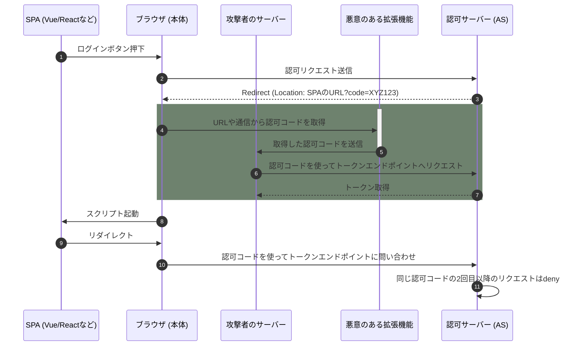
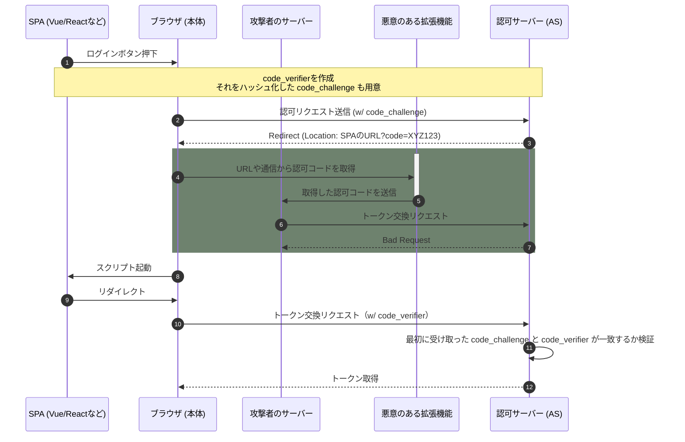

認可コード横取り攻撃とは、パブリッククライアント（モバイルアプリやSPAなど）で悪意のあるアプリが認可コードを盗み出し、アクセストークンを不正に取得する攻撃手法です。
今回は認可コード横取り攻撃とPKCE（RFC7636でOAuthの拡張仕様として定義されている）を使うことで対策されていることを確認し、個人的に思うPKCEのききどころについてまとめます。

### 背景・想定読者

背景はOAuthの仕様は必ずしも安全というわけではなく、場合によってPKCEのような仕様も必要になることの説明にチャレンジします。
想定読者は、認可コードフローについてなんとなく知っているという方向けです。

## 従来のフローと認可コード横取り

今回の認可コード横取り攻撃の説明をしてみます。
認可コード横取り攻撃はその名の通りなんですが、攻撃者が発行された認可コードを使ってアクセストークンを取りに行けてしまいます。

私は普段WebのエンジニアをしているのでSPAを例に説明してみようと思います。
想定するシナリオは以下です。

1. 攻撃用のブラウザ拡張機能がすでに入っている（攻撃アクターがわかりやすいように）
2. 拡張機能が入っているブラウザでSPAでログインボタンを押下
3. ASに認可リクエストが送られ、認可コードが帰ってくる
4. ブラウザ上で認可コードを奪取されてしまう。

シーケンスにしてみると以下のようになります。

認可コードを受け取った人が入れ替わったことを検知しないことが原因で横取りされてしまいました。
横取りされているところは色付きで示しています。
具体的にはSPAから認可コードフローを開始したにもかかわらず、先に攻撃者が認可コードを取得・トークン交換まで済ましてしまったのです。

一番最後、同じ認可コードの2回目以降のトークンエンドポイントへのリクエストは拒絶されるのは必須ですが、1回目のトークンの無効化は必須ではないため攻撃者のアクセストークンが無効になるかどうか実装次第になってしまいますね。。
（必須要件を満たしているかなんてことを疑い出したくないです。）

## PKCEを眺めてみる

PKCEとはどこが拡張されて、認可コードの横取りを対策できるのでしょう？
PKCEでは以下のパラメータが追加されます。詳しくはRFC7636を読みましょう。。

- code_verifier
  - ランダムな文字列が入っているパラメータ
- code_challenge_method
  - `code_challenge`の計算方法を指定するパラメータ 
- code_challenge
  - `code_verifier`を`code_challenge_method`で計算した値

個人的な印象ですが、だいたいSHA256でハッシュしてBase64URLエンコードされた値がcode_challengeに入っている気がします。
（詳細な仕様については追えていません、、）

では実際にこのパラメータで防げるのか、PKCEでのトークンの横取りをみていきましょう

実際にトークンの取得をリクエストしている部分を比べてみましょう。
攻撃者はトークン交換に認可コードを取得してASに問い合わせていますが、`code_verifier`が不足しています。
ASは認可コードを送ってきた相手を`code_verifier`と`code_challenge`を照合することで確認しますが、`code_verifier`の値が足りません（もしくはデタラメな値で照合に失敗するでしょう）。
一方、ユーザーは`code_verifier`をトークン交換時に一緒に送信することで認可リクエストした相手と同一人物であることを照合し、トークンを返します。

認可コードだけ取得できればトークン取得できたフローでは無くなったわけです！めでたし、めでたし？

しかし、PKCEでも気をつけなければならないことは`code_verifier`というランダム文字列や、それをhash化した`code_challenge`から推測できないような値にする必要があります。
クライアント実装も気をつけないといけませんね（今始まったことではないんだが）

## まとめ

大雑把にトークンの横取りというシナリオから、PKCEというOAuthの拡張仕様で防ぐことができそうという説明をしてみました。
ここ間違っていそうなどあれば、Twitter/Bluesky等でDMなどしていただけますと幸いです！
